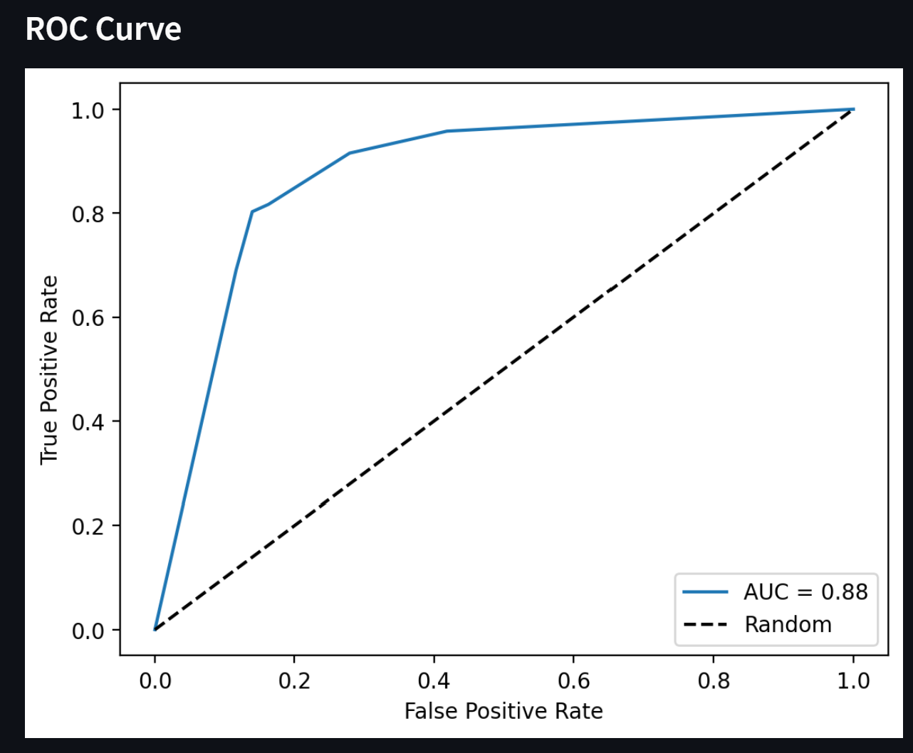
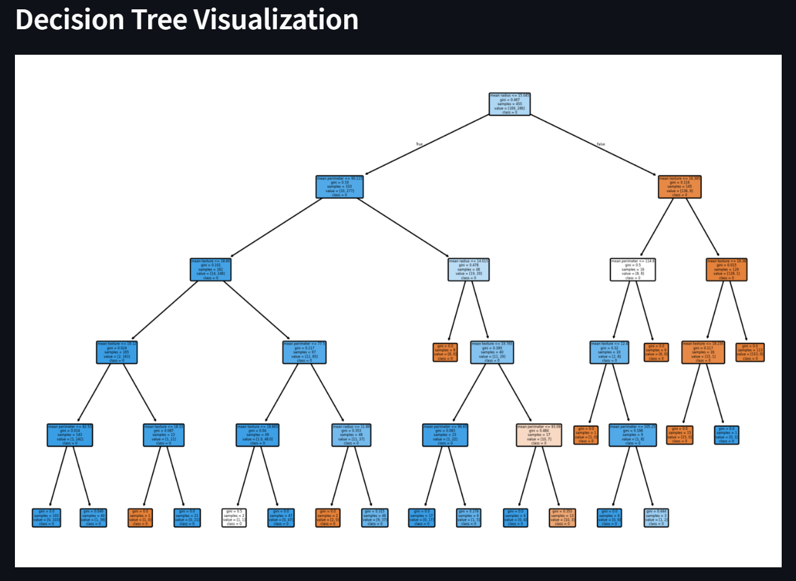

# Machine Learning Application Project

## Project Overview

This project is a Streamlit app that allows users to explore machine learning models on a dataset of their choice. Users can upload their own CSV data or use the loaded Breast Cancer dataset. The app provides an interface for selecting features, training models, and evaluating their performance. Users can experiment with Logistic Regression and Decision Tree models as well as adjust hyperparameters to fine-tune the model.

## Instructions

To run the Streamlit application (`ML Streamlit App.py`), follow these steps:

1.  **Clone the Repository**
  
2.  **Install Dependencies:** Ensure you have the necessary Python libraries installed. Use the `requirements.txt` file to ensure the correct versions are installed

3.  **Run the Streamlit App:** Navigate into the directory containing the Python script and run the app:
    ```bash
    cd MLApplicationApp
    streamlit run MLApplicationApp.py
    ```
    OR
    
 **Run in Streamlit Cloud:** [Link to streamlit cloud](https://petko-data-science-portfolio-bpybmuqcd3dcukxw9rnqg5.streamlit.app/)

## Dataset Description

* **Default Dataset (Breast Cancer):** The app includes the built-in Breast Cancer dataset from scikit-learn. This dataset is commonly used for binary classification tasks.
* **User Upload:** The app supports user-uploaded datasets in `.csv` or `.xlsx` formats. Users are advised to provide clean, structured data with clear headers and a column suitable for use as the target variable (Y).

## Data Preprocessing Steps

The application performs the following preprocessing steps, depending on the selected dataset:

1.  **Data Loading:** Reads data from the selected source (default Breast Cancer dataset or user-uploaded CSV/Excel file).
2.  **Feature Selection:** Allows the user to interactively select the predictor features (X columns) and the target variable (Y column) from the loaded dataset using sidebar selectboxes.
3.  **Data Splitting:** Splits the selected features (X) and target variable (Y) into training and testing sets using `train_test_split` with a test size of 20%.

## Model Implementation and Hyperparameter Selection

The app implements two supervised machine learning models for binary classification:

1.  **Logistic Regression:**
    * A linear model for binary classification.
    * **Hyperparameter (`max_iter` - Maximum Iterations):** This is selected interactively allowing tuning of the maximum number of iterations for the solver to converge.


      
2.  **Decision Tree:**
    * **Hyperparameters (`max_depth`, `min_samples_split`):** These are selected interactively by the user via **Streamlit sliders**, allowing tuning of the maximum depth of the tree (1 to 20) and the minimum number of samples required to split an internal node (2 to 20).
  


After selecting the model and tuning hyperparameters, the model is trained on the training data (`X_train`, `Y_train`) and used to make predictions (`Y_pred`) and predict probabilities (`Y_prob`) on the test data (`X_test`).

## Visualizations and Outputs

The application provides several key outputs and visualizations for model evaluation:

* **Selected Dataset View:** Displays a dataframe showing only the selected X and Y features.
* **Evaluation Metrics:** Displays common classification metrics calculated using scikit-learn:
    * Accuracy Score
    * Precision Score (weighted)
    * Recall Score (weighted)
    * F1-Score (weighted)
    * Confusion Matrix
* **ROC Curve:** Plots the Receiver Operating Characteristic (ROC) curve, which illustrates the model's performance at different classification thresholds, along with the Area Under the Curve (AUC) score.
    * *(Placeholder: ``)*
* **Decision Tree Visualization:** If the Decision Tree model is selected, the app displays a plot of the trained decision tree structure, showing how the model makes decisions based on the selected features.
    * *(Placeholder: ``)*

## Visual Examples

*(Include screenshots of your running application here to illustrate its features and the generated plots. You can add images by placing them in a folder (e.g., `images`) in your repository and linking them like this: ``)*.

* Screenshot showing the sidebar controls and dataset/feature selection.
* Screenshot showing the selected dataset display.
* Screenshot showing the evaluation metrics section.
* Screenshot showing the ROC Curve.
* Screenshot showing the Decision Tree visualization.

---

**Project Author:** Zach Petko

