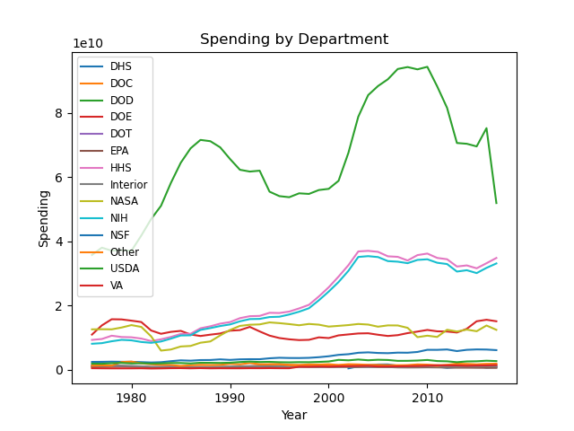
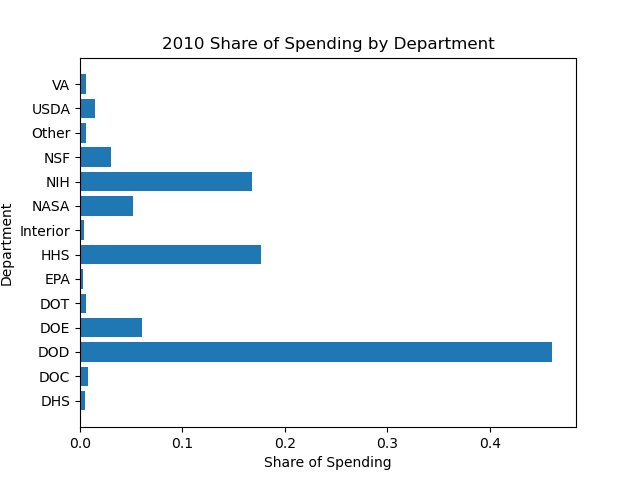

# Tidy Data Project: Federal R&D Spending 

## Project Overview
This project aims to clean and make tidy data gathered on Federal R&D Spending. After making the data tidy, visualizations and a pivot table is created to provide a preliminary analysis of Federal R&D Spending. Tidy data fits these criteria:
- Each variable forms a column.
- Each observation forms a row.
- Each type of observational unit forms a table.

This project contributes to my data science portfolio by showcasing my ability to clean, tidy, and visualize real-world data, and enhancing my data analysis skills.

## Instructions

To run the Jupyter Notebook (`Tidy_Data_Project.ipynb`) and reproduce the analysis, follow these steps:

1.  **Clone the Repository**
2.  **Install Dependencies**
    Ensure you have pandas and matplotlib Python libraries installed.
3.  **Run the Jupyter Notebook**

## Dataset Description

-   **Source:** The dataset "Federal R&D Budgets" (`fed_rd_year&gdp.csv`) was adapted from a [GitHub repository](https://github.com/rfordatascience/tidytuesday/tree/main/data/2019/2019-02-12).
-   **Content:** It contains federal Research and Development (R&D) spending, broken down by department and year in wide format.

## Data Cleaning and Tidy Process

The data was transformed to be tidy using the following steps:

1.  **Load Data:** The raw CSV file was loaded into a pandas DataFrame.
2.  **Rename Columns:** Column names were simplified to just the year instead of the given long name.
3.  **Melting Data:** The DataFrame was melted to create `department`, `Year`, and `Spending` columns.
4.  **Numeric Year:** The `Year` column was converted to a numeric data type.

## Visualizations

### 1. Time Series Spending Line Chart

This chart displays the spending trends over time for each department with a different line and color for each department.

  

### 2. Spending Share Bar Chart

This chart displays the share of spending for each department in the year selected by the user.

## Pivot Table

This table displays the median department spending for each year in the dataset in the form of a pivot table.

